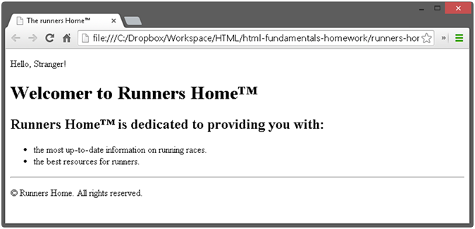
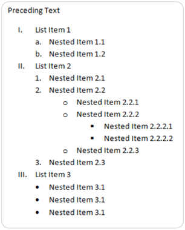
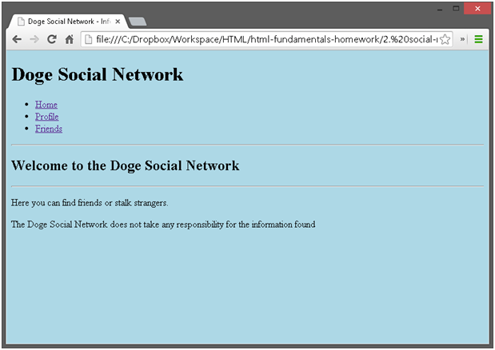
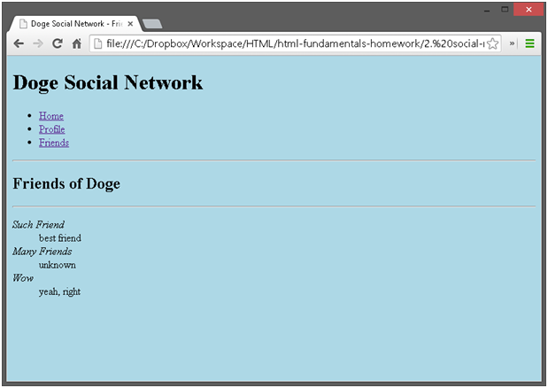
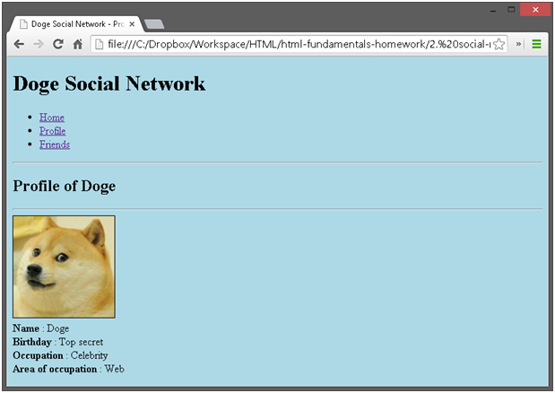

# HTML Overview Homework:

## 1.Hello HTML

Create a HTML document holding the text "Hello HTML". Ensure you have `<doctype>, <html>, <head>, <title> and <body>`. Play with the other tags.

## 2.Paragraphs and Images of Text

Create an HTML page holding a few headings, each with a few paragraphs of text. Insert a few images. Play with the old formatting tags `<b>, <i>, <u>, <strong>, <em>, , , <pre>,  ` etc. Ensure you have `<doctype>, <html>, <head>, <title> and <body>`.

## 3.Runners Home

Write an HTML page like the image below (use headings, `
`, paragraphs and `<ul>`):

## 4.HTML Lists

Create a HTML page that holds nested lists like the example on the below (without the border and the rounded corners). Use `<ol>, <ul> and <li>`.

## 5.PowerPoint Slide

Create a Web page that looks like this PowerPoint slide (100% accuracy is not required):

## 6.User Profile Pages

Create user profile Web pages named profile.html, friends page named friends.html and info page named home.html. Link them to one another using `<a href="…">` tag. The pages should look like the following:

